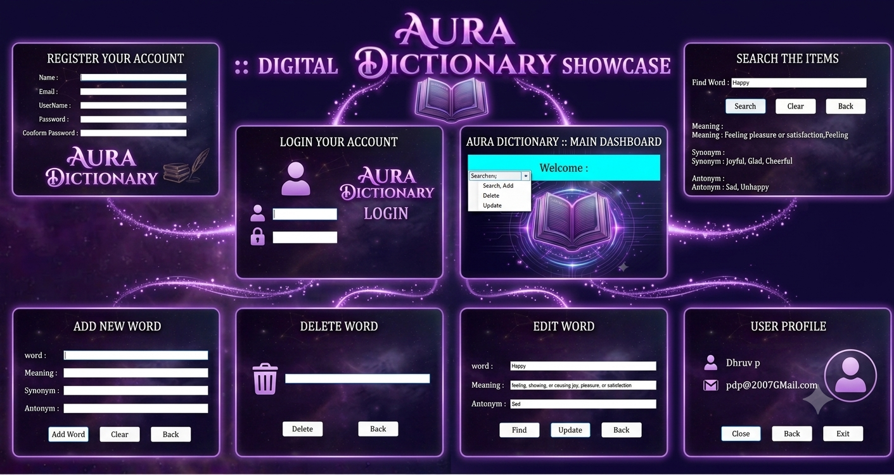

<br> # 🌌 Aura Dictionary (Aura_Dictionary) </br>

> A modern, elegant, and interactive Desktop Dictionary Application built using C# Windows Forms and Database integration. **Aura Dictionary** provides complete vocabulary management, user authentication, and seamless lexical search with an immersive cosmic-themed UI.

---

## 📸 Screenshots & Showcase



---

## ✨ Key Features & Detailed Breakdown

- 🔐 **User Authentication & Authorization**:
  - **Account Registration**: Allows new users to create an account with input fields for Name, Email, Username, Password, and Confirm Password, including client-side validation to prevent duplicate entries and mismatched passwords.
  - **Secure Login**: Verifies credentials securely against the database.
  - **State & Session Management**: Tracks the logged-in user dynamically across all forms via `UserSession.cs`.

- 📖 **Comprehensive Vocabulary Management (CRUD)**:
  - **Search Word (`Ctrl + S`)**: Instant keyword search that retrieves the exact word meaning, definition, phonetic details, synonyms, and antonyms with a single click.
  - **Add Word (`Ctrl + A`)**: Dedicated form to insert new vocabulary into the database along with customized meanings, synonym lists, and antonym pairs.
  - **Edit / Update Word (`Ctrl + E`)**: Search existing vocabulary records and update definitions or lexical data seamlessly.
  - **Delete Word (`Ctrl + Del`)**: Safe word-deletion module that allows users to look up and remove unwanted words from the database with confirmation prompts.

- 👤 **Profile & Account Management**:
  - **Profile Viewer**: Displays current active user details including Full Name, Email ID, and Username directly from the session.
  - **Session Control**: Quick access to Logout and Exit routines to safeguard user data.

- 🎨 **Modern Cosmic UI/UX**:
  - Sci-Fi cosmic purple aesthetics with glowing neon borders and semi-transparent panels.
  - Optimized Windows Forms layout with intuitive MenuStrip navigation and quick keyboard access.

---

## 🛠️ Technology Stack

- **Framework**: .NET Framework (Windows Forms / WinForms)
- **Language**: C# (`.cs`)
- **Database**: ADO.NET / SQL Database (`DBConnection.cs`)
- **IDE**: Microsoft Visual Studio 2022 / 2019
- **Architecture**: Modular Multi-Form Architecture with centralized Session & DB handling

---

## 📂 Project Architecture & File Structure

```text
Aura_dictionary/
│
├── 📄 Program.cs                  # Application Entry Point
├── 📄 DBConnection.cs             # Centralized Database Connection Handler
├── 📄 UserSession.cs              # Global State & User Session Tracker
│
├── 🖥️ Windows Forms & UI:
│   ├── Form1.cs / Form1.Designer.cs           # User Registration Form
│   ├── Form2.cs / Form2.Designer.cs           # User Login Form
│   ├── FrmMain.cs / FrmMain.Designer.cs       # Main Navigation Dashboard
│   ├── FrmDictionary.cs                       # Search & Dictionary Operations
│   ├── FrmAddWord.cs                          # Add New Word Module
│   ├── FrmEditWord.cs                         # Edit / Update Word Module
│   ├── FrmDeleteWord.cs                       # Delete Word Module
│   └── FrmProfile.cs                          # User Profile View
│
├── 📁 Assets/                     # Main.png & UI Graphics
└── 📁 Properties/                 # Assembly & Resource Configurations
